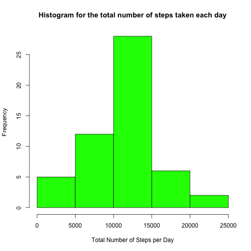

#Reproducible Research: Peer Assessment 1  


## Loading and preprocessing the data

```r
##checks if the data directory exists, if not then it is created
if(!file.exists("./data"))
        {dir.create("./data")}

##Checks whether the activity.csv file exists, if not then the correspondent zip file is downloaded and unziped
if(!file.exists("./data/activity.csv")) {
        
        fileUrl <- "http://d396qusza40orc.cloudfront.net/repdata%2Fdata%2Factivity.zip"
        os <- Sys.info()['sysname'] 
                
                if (!os %in% "Windows") 
                        download.file(fileUrl, destfile ="./data/repdata-data-activity.zip", method = "curl")
                else 
                        download.file(fileUrl, destfile ="./data/repdata-data-activity.zip")
        ##unzip file
        unzip ("./data/repdata-data-activity.zip", exdir = "./data")
}

##Load the data
activityData  <- read.csv("./data/activity.csv", header = TRUE, na.strings = "NA")

##Processing the data
##looking to the data
head(activityData)
```

```
##   steps       date interval
## 1    NA 2012-10-01        0
## 2    NA 2012-10-01        5
## 3    NA 2012-10-01       10
## 4    NA 2012-10-01       15
## 5    NA 2012-10-01       20
## 6    NA 2012-10-01       25
```

```r
str(activityData)
```

```
## 'data.frame':	17568 obs. of  3 variables:
##  $ steps   : int  NA NA NA NA NA NA NA NA NA NA ...
##  $ date    : Factor w/ 61 levels "2012-10-01","2012-10-02",..: 1 1 1 1 1 1 1 1 1 1 ...
##  $ interval: int  0 5 10 15 20 25 30 35 40 45 ...
```

```r
##The variable date are formated as a factor, so here I make some processing to transform this variable from factor to Date format
activityData$date  <- as.Date(activityData$date, format = "%Y-%m-%d")

##Confirm date variable new format
str(activityData$date)
```

```
##  Date[1:17568], format: "2012-10-01" "2012-10-01" "2012-10-01" "2012-10-01" ...
```

```r
##Here I check what NA's mean represent to the dataframe and we can see the NA's represent a mean of aprox. 13% of the total data. This NA's will be dealt with later in this project assignment. 
mean(is.na(activityData$steps))
```

```
## [1] 0.1311475
```


## What is mean total number of steps taken per day?

```r
##First I calculate the total number of steps taken per day using the aggregate function because it returns a data frame which I prefer for this particular case
totalStepsPerDay  <- aggregate(steps ~ date, data=activityData, sum, na.rm = TRUE)
##histogram of the total number of steps taken each day
hist(totalStepsPerDay$steps, col = "green", main="Histogram for the total number of steps taken each day", xlab="Total Number of Steps per Day")
```

 

```r
##Calculate and report the mean and median of the total number of steps taken per day:
##Calculation of the mean of the total number of steps taken per day
mean(totalStepsPerDay$steps)
```

```
## [1] 10766.19
```

```r
##Calculation the median of the total number of steps taken per day
median(totalStepsPerDay$steps)
```

```
## [1] 10765
```


## What is the average daily activity pattern?

```r
##In order to analyse the average daily activity pattern, I create time series plot of the 5-minute interval (x-axis) and the average number of steps taken, averaged across all days (y-axis)
##First, I need to create a new dataframe with the mean of the number of steps taken across all days grouped by the 5-minute interval
averageDailyActPat  <- aggregate(x=list(steps=activityData$steps), by=list(interval=activityData$interval), FUN=mean, na.rm = TRUE)
##Now I create the plot of the average daily activity pattern from the data obtained on the previous step
with(averageDailyActPat, plot(interval, steps, type="l", col = "red", xlab = "5-min Interval",
                                      ylab = "Average Number of Steps Across All Days", 
                                      main = "Time Series Plot of the \n Average Daily Activity Pattern"))
```

 

```r
##Here I check which is the 5-minute interval, on average across all the days in the dataset, that contains the maximum number of steps
averageDailyActPat[which.max(averageDailyActPat$steps),"interval"]
```

```
## [1] 835
```

## Imputing missing values

```r
##Calculation of the total number of missing values (NA) in the dataset
sum(is.na(activityData)) 
```

```
## [1] 2304
```

```r
##The presence of missing days, resulting from missing values (NA's), may introduce bias into some calculations or summaries of the data. Therefore, it is necessary to devise a strategy for filling in all of the missing values in the dataset. So, the NA's will be replaced with the mean of steps taken for each 5-minute interval. This is done in two parts:
##First, I create a new data frame with the mean of steps for each 5-minute interval
meanOfStepsForInterval  <- aggregate(x=list(meanOfSteps=activityData$steps), by=list(interval=activityData$interval), FUN=mean, na.rm = TRUE)

##Now, I create a new numeric vector with both: 
## - the values of the mean of steps that will replace the NA's in the dataset for the correspondent 5-minute interval
## and
## - the original values of the steps that were already filled in in the dataset (that wasn´t NA). 
##All this values are loaded into this numeric vector by the correspondent row position of the dataset. 
missingValues  <- numeric()
for (i in 1:nrow(activityData)){
       
        if(!is.na(activityData$steps[i])){
                missingValues  <- c(missingValues, activityData$steps[i])            
                
        } else {
                meanOfSteps <- meanOfStepsForInterval$meanOfSteps[which(activityData$interval[i] == meanOfStepsForInterval$interval)]
                missingValues  <- c(missingValues, meanOfSteps)
        }
}

##Finally, I create a new dataset that is equal to the original dataset but with the missing data filled in.
activityData_noNA <- activityData
activityData_noNA$steps  <- missingValues

##Here I check if still exists any missing values (NA) in the new dataset.I can see that the result is zero (0), which means that all NA's were filled in.
sum(is.na(activityData_noNA))
```

```
## [1] 0
```

```r
##With the new dataset (whithout missing days) I make a Histogram of the total number of steps taken each day
totalStepsPerDay_noNA  <- aggregate(x=list(steps=activityData_noNA$steps), by=list(date=activityData_noNA$date), FUN=sum, na.rm = TRUE)
hist(totalStepsPerDay_noNA$steps, col = "blue", main="Histogram for the total number of steps taken each day", xlab="Total Number of Steps per Day")
```

 

```r
##mean of the total number of steps taken per day
mean(totalStepsPerDay_noNA$steps)
```

```
## [1] 10766.19
```

```r
##median of total number of steps taken per day
median(totalStepsPerDay_noNA$steps)
```

```
## [1] 10766.19
```

```r
##Do these values differ from the estimates from the first part of the assignment?
##There is no difference of the mean values of steps taken per day and there is only a faintest difference of the median values. Below I make the analysis and report for this values. The analysis is done by calculating the percentage increase of the mean and median for the total daily steps taken per day. Thus, if the result is positive then the percentage has increased; if the result is negative then the percentage has decreased:

##By analysing the means of the daily number of steps, we can see that the it did not change
format((mean(totalStepsPerDay_noNA$steps)-mean(totalStepsPerDay$steps))/mean(totalStepsPerDay$steps)*100, scientific = F)
```

```
## [1] "0"
```

```r
##By analysing the medians of the daily number of steps, we can see that it hardly changed, having had a very slight increased by approximately 0.011%
format((median(totalStepsPerDay_noNA$steps)-median(totalStepsPerDay$steps))/median(totalStepsPerDay$steps)*100, scientific = F)
```

```
## [1] "0.01104207"
```

```r
##What is the impact of imputing missing data on the estimates of the total daily number of steps?
##There is an expected increase of the frequency of the number of observation days when the total number of steps is between 10000 and 15000, which is due to the existence of a greater number of days included in this histogram comparing to the first part of the assignment when there were a few days with missing values (NA's) and those days were not included in the histogram calculation. Nevertheless, there is no impact of the mean values for the total number os steps taken per day and there is just a slight increase of the median value, that is aproximately 0.011%. So the impact is almost nor existant.
```


## Are there differences in activity patterns between weekdays and weekends?

```r
##In order answer this question first I need to create a new factor variable in the dataset with two levels – “weekday” and “weekend” indicating whether a given date is a weekday or weekend day.

##In order to implement my solution I need to install and load the timeDate package
if("timeDate" %in% rownames(installed.packages()) == FALSE) {install.packages("timeDate", repos="http://cran.rstudio.com/")}
library(timeDate)

#With a logical vector I create with the isWeekday() function, I create a factor with two levels/labels and with this factor I create a new column in the activityData_noNA dataset
activityData_noNA$wDay <- factor(isWeekday(activityData_noNA$date), levels=c("TRUE", "FALSE"), labels=c('Weekday', 'Weekend'))

##check the new two level factor column in the dataset and looks OK
str(activityData_noNA)
```

```
## 'data.frame':	17568 obs. of  4 variables:
##  $ steps   : num  1.717 0.3396 0.1321 0.1509 0.0755 ...
##  $ date    : Date, format: "2012-10-01" "2012-10-01" ...
##  $ interval: int  0 5 10 15 20 25 30 35 40 45 ...
##  $ wDay    : Factor w/ 2 levels "Weekday","Weekend": 1 1 1 1 1 1 1 1 1 1 ...
```

```r
##Now, with the new column I can analyse the activity pattern between weekdays and weekends
averageSteps <- aggregate(x=list(meanSteps=activityData_noNA$steps), by=list(interval=activityData_noNA$interval, wDay=activityData_noNA$wDay), FUN=mean)

if("ggplot2" %in% rownames(installed.packages()) == FALSE) {install.packages("ggplot2", repos="http://cran.rstudio.com/")}
library(ggplot2)
```

```
## Warning: package 'ggplot2' was built under R version 3.1.3
```

```r
##Here, in order to visualize the activity pattern, I make a time series plot of the 5-minute interval (x-axis) and the average number of steps taken, averaged across all weekday days or weekend days (y-axis) 
g <- ggplot(averageSteps, aes(interval, meanSteps, color=wDay)) 
g + geom_line() + facet_wrap(~ wDay, nrow=2, ncol=1 ) + ggtitle("Activity Patterns For Weekdays and Weekends") +
    theme(plot.title = element_text(face="bold", size=10)) + 
    xlab("5-minute Interval") + ylab("Average Number of Steps") +
    theme(axis.text=element_text(size=10), axis.title=element_text(size=10))
```

 

